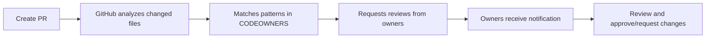
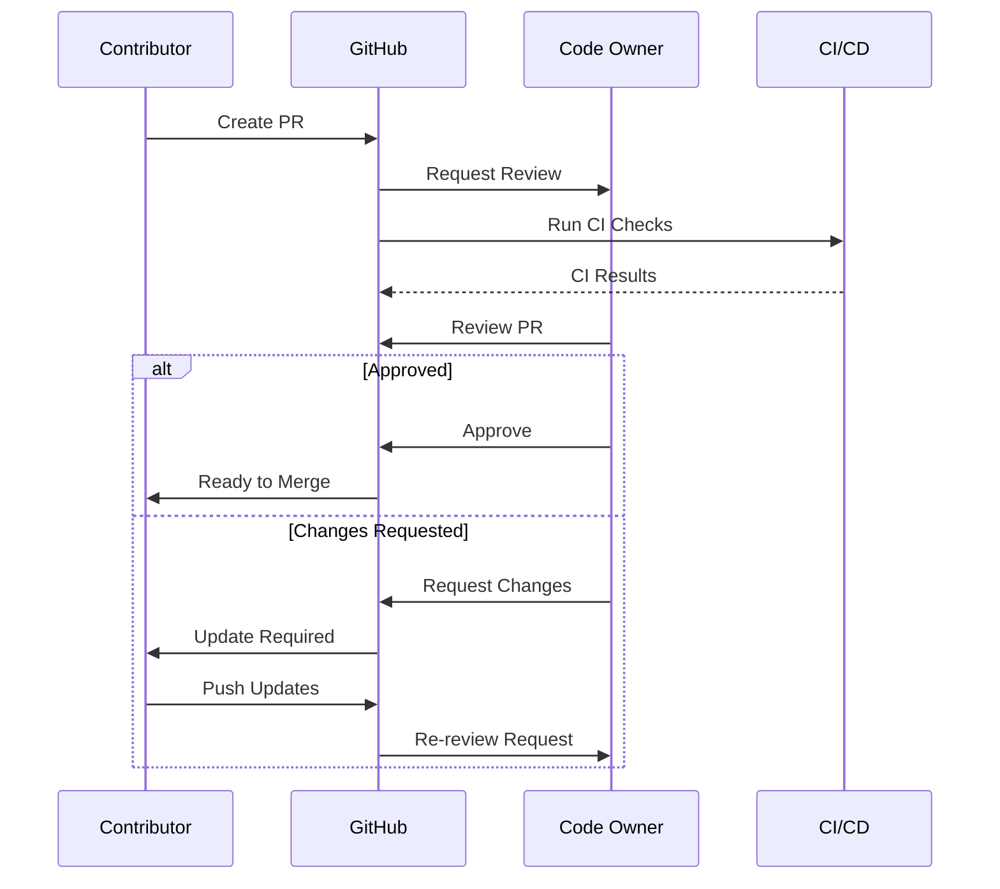

# 👥 CODEOWNERS Guide

> Complete guide to code ownership in Rice Monorepo

---

## 📋 Table of Contents

- [Overview](#overview)
- [How CODEOWNERS Works](#how-codeowners-works)
- [File Syntax](#file-syntax)
- [Ownership Structure](#ownership-structure)
- [Review Process](#review-process)
- [Best Practices](#best-practices)
- [For Code Owners](#for-code-owners)
- [For Contributors](#for-contributors)
- [Troubleshooting](#troubleshooting)

---

## 🎯 Overview

The CODEOWNERS file defines who is responsible for reviewing changes to specific parts of the codebase. When someone
creates a pull request, GitHub automatically requests reviews from the relevant code owners.

**Benefits:**

- ✅ Automatic review assignment
- ✅ Domain expertise on every PR
- ✅ Clear ownership boundaries
- ✅ Faster review cycles
- ✅ Knowledge distribution

**Official Documentation**:
[About code owners](https://docs.github.com/en/repositories/managing-your-repositorys-settings-and-features/customizing-your-repository/about-code-owners)

---

## ⚙️ How CODEOWNERS Works

### Automatic Assignment



### Example Flow

1. **Developer creates PR** changing `backend/db/query.go`
2. **GitHub checks CODEOWNERS** and finds:

   ```
   /backend/**/*.go @mrDinkelman
   ```

3. **Review requested** from @mrDinkelman automatically
4. **Owner reviews** and approves/requests changes
5. **PR can be merged** after owner approval

---

## 📝 File Syntax

### Basic Pattern

```bash
# Pattern  Owner(s)
/docs/    @doc-team
```

### Multiple Owners

```bash
# Require approval from both owners
/backend/  @mrDinkelman @backend-lead
```

### Teams (GitHub Organizations)

```bash
# Require approval from team
/frontend/  @org-name/frontend-team
```

### File Extensions

```bash
# All TypeScript files
**/*.ts     @typescript-experts

# All test files
**/*.test.* @qa-team
```

### Order Matters

Last matching pattern wins:

```bash
# Default owner
*  @default-owner

# Specific override
/backend/  @backend-owner

# Most specific wins
/backend/critical/  @critical-owner
```

### Comments

```bash
# This is a comment
# Commented ownership: /ignored @owner
```

---

## 🏗️ Ownership Structure

### Current Organization

Our CODEOWNERS file is organized by:

1. **Default Ownership**
2. **Documentation Files**
3. **Root Configuration**
4. **Build System**
5. **CI/CD & DevOps**
6. **Backend Components**
7. **Frontend Components**
8. **Bots & AI**
9. **Protocol Buffers**
10. **Security & Compliance**
11. **Dependencies**

### Ownership Hierarchy

```
Repository Root
├── Default: @mrDinkelman
├── Backend
│   ├── Go Services: @mrDinkelman
│   ├── Rust Contracts: @mrDinkelman
│   └── Solidity Contracts: @mrDinkelman
├── Frontend
│   ├── TypeScript: @mrDinkelman
│   ├── Flutter: @mrDinkelman
│   ├── Android: @mrDinkelman
│   └── iOS: @mrDinkelman
├── Bots
│   └── Python AI: @mrDinkelman
├── Schema
│   └── Protocol Buffers: @mrDinkelman
└── Infrastructure
    ├── Terraform: @mrDinkelman
    ├── Kubernetes: @mrDinkelman
    └── Ansible: @mrDinkelman
```

---

## 🔍 Review Process

### For Pull Requests

#### 1. Creating a PR

```bash
git checkout -b feature/awesome-feature
git add .
git commit -m "feat: add awesome feature"
git push origin feature/awesome-feature
```

Create PR on GitHub → Code owners automatically assigned

#### 2. Review Requirements

- **At least one code owner approval required**
- **All requested changes must be resolved**
- **All CI checks must pass**
- **Branch must be up to date with base**

#### 3. Review Timeline

- **Standard PR**: Response within 2 business days
- **Urgent PR**: Tag with `urgent` label
- **Security PR**: Expedited review (< 24h)

### Review Workflow



---

## 📖 File Patterns Explained

### Backend Patterns

```bash
# All Go files in backend
/backend/**/*.go @mrDinkelman

# Specific service
/backend/db/ @mrDinkelman

# Smart contracts
/backend/contract/rust/ @mrDinkelman
/backend/contract/solidity/ @mrDinkelman
```

### Frontend Patterns

```bash
# TypeScript/JavaScript
/frontend/node/**/*.{ts,tsx,js,jsx} @mrDinkelman

# Flutter/Dart
/frontend/dart/**/*.dart @mrDinkelman

# Android
/frontend/android/**/*.{kt,kts} @mrDinkelman

# iOS
/frontend/ios/**/*.swift @mrDinkelman
```

### Configuration Files

```bash
# Root config
/.editorconfig @mrDinkelman
/.gitignore @mrDinkelman
/renovate.json @mrDinkelman

# Bazel
/BUILD.bazel @mrDinkelman
/MODULE.bazel @mrDinkelman
/WORKSPACE @mrDinkelman

# CI/CD
/.github/ @mrDinkelman
/Makefile @mrDinkelman
```

### Documentation

```bash
# All Markdown files
*.md @mrDinkelman

# Documentation directory
/docs/ @mrDinkelman

# Specific docs
README @mrDinkelman
CONTRIBUTING @mrDinkelman
SECURITY @mrDinkelman
```

### Dependencies

```bash
# Python
**/pyproject.toml @mrDinkelman
**/poetry.lock @mrDinkelman

# Go
**/go.mod @mrDinkelman
**/go.sum @mrDinkelman

# Node.js
package.json @mrDinkelman
package-lock.json @mrDinkelman

# Rust
**/Cargo.toml @mrDinkelman
**/Cargo.lock @mrDinkelman
```

---

## 🎯 Best Practices

### For Code Owners

#### ✅ DO

**Respond Promptly**

- Acknowledge PRs within 1 business day
- Complete reviews within 2 business days
- Use "Request changes" for blocking issues
- Use comments for suggestions

**Provide Constructive Feedback**

```markdown
# Good Review Comment

This implementation works, but consider using a more efficient algorithm. Here's an example: [link to docs]

Would you like me to pair with you on optimizing this?
```

**Automate When Possible**

- Use automated checks (linters, tests, security scans)
- Only review what humans should review
- Document review criteria

**Share Knowledge**

- Add code comments explaining "why"
- Link to relevant documentation
- Mentor junior developers

**Be Available**

- Set GitHub notification preferences
- Use vacation mode when unavailable
- Assign backup reviewers

#### ❌ DON'T

**Don't Block Without Reason**

```markdown
# Bad Review Comment

This is wrong.

# Good Review Comment

This approach might cause issues because [specific reason]. Consider [alternative approach] instead. Here's why:
[explanation/link]
```

**Don't Nitpick**

- Focus on significant issues
- Use auto-formatters for style
- Separate blocking vs non-blocking feedback

**Don't Be a Bottleneck**

- Review within SLA (2 business days)
- Delegate when overwhelmed
- Train additional owners

### For Contributors

#### ✅ DO

**Prepare Your PR**

- Write clear description
- Add tests
- Run linters locally
- Keep PRs focused and small

**Respond to Feedback**

- Address all comments
- Ask for clarification if unclear
- Mark resolved conversations
- Thank reviewers

**Keep PR Updated**

- Rebase on latest main
- Resolve merge conflicts
- Update after review changes

#### ❌ DON'T

**Don't Bypass Reviews**

- Never force push to main
- Don't merge without approvals
- Respect the process

**Don't Take Feedback Personally**

- Code review != personal review
- Ask questions, don't argue
- Learn from feedback

---

## 🔧 Modifying CODEOWNERS

### When to Update

- New component added
- Team structure changes
- Owner leaves/joins project
- Ownership rebalancing needed

### Update Process

1. **Edit File**

   ```bash
   vim .github/CODEOWNERS
   ```

2. **Test Patterns**

   ```bash
   # Use GitHub's CODEOWNERS validator
   # Or test manually by creating test PR
   ```

3. **Commit Changes**

   ```bash
   git add .github/CODEOWNERS
   git commit -m "chore: update CODEOWNERS"
   git push origin main
   ```

4. **Notify Team**
   - Announce in team chat
   - Update team documentation
   - Train new owners

### Syntax Validation

GitHub validates CODEOWNERS syntax automatically. Check:

- **Settings → Branches → Branch protection rules**
- Enable "Require review from Code Owners"

---

## 🚨 Troubleshooting

### Issue: Code Owner Not Assigned

**Problem**: PR created but owner not requested for review

**Solutions**:

1. **Check Pattern Match**

   ```bash
   # Verify file matches pattern
   # Remember: Last matching pattern wins
   ```

2. **Check Owner Exists**

   - Owner username must be valid
   - Team must exist in organization
   - Owner must have repository access

3. **Check Repository Settings**

   - Settings → Branches
   - Verify "Require review from Code Owners" is enabled

4. **Manual Assignment**
   - Click "Reviewers" on PR
   - Manually add code owner

### Issue: Too Many Owners Required

**Problem**: PR requires approval from many owners

**Solutions**:

1. **Refine Patterns**

   ```bash
   # Too broad
   /backend/ @owner1 @owner2 @owner3

   # Better: specific patterns
   /backend/db/ @db-owner
   /backend/api/ @api-owner
   ```

2. **Use Teams**

   ```bash
   # Instead of multiple individuals
   /backend/ @backend-team
   ```

3. **Adjust Protection Rules**
   - Settings → Branches → Branch protection
   - Adjust "Required number of approvals"

### Issue: Owner Not Receiving Notifications

**Problem**: Code owner not notified of review requests

**Solutions**:

1. **Check Notification Settings**

   - Profile → Settings → Notifications
   - Enable "Pull request reviews"

2. **Check Watch Settings**

   - Repository → Watch → Custom
   - Enable "Pull requests"

3. **Check Email Settings**
   - Verify email address is correct
   - Check spam folder

---

## 📊 Code Ownership Metrics

### Tracking Ownership Health

Monitor these metrics:

| Metric                 | Target                   | Red Flag        |
| ---------------------- | ------------------------ | --------------- |
| Average review time    | < 2 days                 | > 5 days        |
| Owner response rate    | > 90%                    | < 70%           |
| PRs per owner/week     | 5-15                     | > 30            |
| Review thoroughness    | High                     | Rubber stamping |
| Knowledge distribution | Multiple owners per area | Single owner    |

### GitHub Insights

Use GitHub's built-in analytics:

- **Insights → Pulse** : PR activity
- **Insights → Contributors** : Contribution distribution
- **Insights → Code frequency** : Change patterns

---

## 🎓 Code Ownership Philosophy

### Ownership ≠ Gatekeeping

Good code ownership:

- ✅ Ensures quality through expertise
- ✅ Distributes knowledge
- ✅ Mentors contributors
- ✅ Accelerates development

Bad code ownership:

- ❌ Creates bottlenecks
- ❌ Hoards knowledge
- ❌ Slows development
- ❌ Discourages contribution

### Collective Code Ownership

While we have designated owners:

- **Anyone can contribute to any area**
- **Owners are facilitators, not gatekeepers**
- **Goal is knowledge sharing, not control**
- **Encourage cross-team contributions**

### Growing New Owners

Path to becoming a code owner:

1. **Contribute regularly** to an area
2. **Demonstrate expertise** through quality PRs
3. **Review others' PRs** in that area
4. **Maintain code** (fix bugs, improve docs)
5. **Mentor newcomers**
6. **Request ownership** when ready

---

## 📚 Additional Resources

### Official Documentation

- [About code owners](https://docs.github.com/en/repositories/managing-your-repositorys-settings-and-features/customizing-your-repository/about-code-owners)
- [Code owner file syntax](https://docs.github.com/en/repositories/managing-your-repositorys-settings-and-features/customizing-your-repository/about-code-owners#codeowners-syntax)
- [Branch protection rules](https://docs.github.com/en/repositories/configuring-branches-and-merges-in-your-repository/defining-the-mergeability-of-pull-requests/about-protected-branches)

### Tools

- [CODEOWNERS Generator](https://github.com/gagoar/codeowners-generator)
- [CODEOWNERS Validator](https://github.com/mszostok/codeowners-validator)
- [GitHub CLI](https://cli.github.com/)

### Best Practices

- [Google's Code Review Guide](https://google.github.io/eng-practices/review/)
- [Microsoft's PR Guidelines](https://docs.microsoft.com/en-us/azure/devops/repos/git/pull-requests)
- [Thoughtbot's Code Review Guide](https://github.com/thoughtbot/guides/tree/main/code-review)

---

## ❓ FAQ

**Q: Can I have multiple CODEOWNERS files?** A: Yes, in `.github/`, root, or `docs/`. First found is used.

**Q: What if I disagree with a code owner's decision?** A: Discuss respectfully, escalate to team lead if needed,
document decision.

**Q: How do I become a code owner?** A: Contribute regularly, demonstrate expertise, request addition via PR.

**Q: Can code owners approve their own PRs?** A: Technically yes, but best practice is to have another owner review.

**Q: What if a code owner is unavailable?** A: Assign backup reviewer, or temporarily adjust CODEOWNERS.

**Q: Do automated bots count as reviews?** A: No, only human code owner approvals count toward requirements.

---

<div align="center">

**Questions about code ownership?**

[Ask in Discussions](../../discussions) · [View CODEOWNERS File](../CODEOWNERS) · [Team Structure](../../wiki/Team)

</div>
