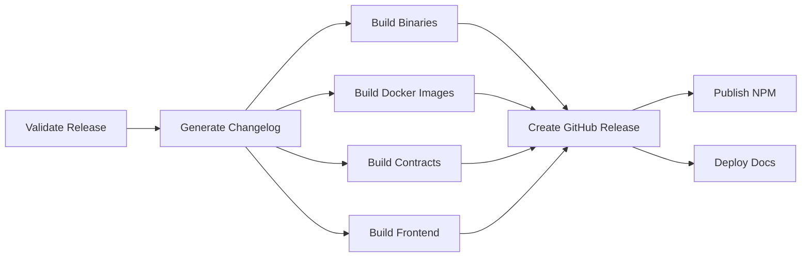

# 🔄 Workflows Documentation

> Complete guide to GitHub Actions workflows in Rice Monorepo

---

## 📋 Table of Contents

- [Overview](#overview)
- [Workflow Organization](#workflow-organization)
- [Continuous Integration Workflows](#continuous-integration-workflows)
- [Continuous Deployment Workflows](#continuous-deployment-workflows)
- [Security Workflows](#security-workflows)
- [Utility Workflows](#utility-workflows)
- [Workflow Configuration](#workflow-configuration)
- [Secrets and Variables](#secrets-and-variables)
- [Best Practices](#best-practices)
- [Troubleshooting](#troubleshooting)

---

## 🎯 Overview

Our CI/CD pipeline consists of 13+ automated workflows that ensure code quality, security, and reliable releases:

- **5 CI Workflows**: Build, Test, Lint, Type Check, Format Check
- **2 CD Workflows**: Release, Subrepo Sync
- **4 Security Workflows**: CodeQL, Trivy, GitLeaks, Security Audit
- **2 Utility Workflows**: Documentation Deploy, Stale Issue Management

### Key Features

- ✅ **Multi-Language Support**: Python, Go, TypeScript, Rust, Solidity, Dart
- ✅ **Parallel Execution**: Jobs run concurrently for speed
- ✅ **Comprehensive Testing**: Unit, Integration, E2E tests
- ✅ **Security-First**: Multiple security scanning layers
- ✅ **Artifact Management**: Build artifacts stored and versioned
- ✅ **Smart Caching**: Dependencies cached for faster runs

---

## 📂 Workflow Organization

### Naming Convention

```
{type}-{function}.yml

Types:
  ci-    → Continuous Integration
  cd-    → Continuous Deployment
  sec-   → Security & Compliance
  meta-  → Repository Management
  docs-  → Documentation
```

### Trigger Patterns

| Trigger             | Usage                                    |
| ------------------- | ---------------------------------------- |
| `push: branches`    | Run on every commit to specific branches |
| `pull_request`      | Run on PRs to verify changes             |
| `schedule: cron`    | Periodic execution (daily, weekly)       |
| `workflow_dispatch` | Manual execution with parameters         |
| `merge_group`       | Run on merge queue                       |

---

## 🏗️ Continuous Integration Workflows

### 1. Build Workflow (`ci-build.yml`)

**Purpose**: Verify all code compiles successfully

**Official Docs**:
[GitHub Actions - Building and Testing](https://docs.github.com/en/actions/automating-builds-and-tests)

#### What It Does

1. **Bazel Build**: Builds entire monorepo with Bazel
2. **Component Builds**: Individual component builds (Go, TypeScript, Python)
3. **Contract Builds**: Smart contract compilation (Rust, Solidity)
4. **Proto Generation**: Protocol buffer code generation

#### Configuration

```yaml
concurrency:
  group: ${{ github.workflow }}-${{ github.ref }}
  cancel-in-progress: true # Cancel old runs on new push
```

#### Key Jobs

- **bazel-build**: Main monorepo build with caching
- **component-builds**: Matrix build for each component
- **rust-build**: Rust smart contracts with clippy
- **solidity-build**: Hardhat contract compilation
- **proto-build**: Buf protocol buffer validation

#### Artifacts Generated

- Build profiles (`bazel-build-profile.txt`)
- Compiled contracts (Rust WASM, Solidity artifacts)
- Generated proto code

#### Optimization Tips

```bash
# Local testing
bazelisk build --config=ci //...

# View build profile
bazelisk analyze-profile bazel-out/profile.gz
```

---

### 2. Test Workflow (`ci-test.yml`)

**Purpose**: Execute comprehensive test suites

**Official Docs**:
[Testing Node.js](https://docs.github.com/en/actions/automating-builds-and-tests/building-and-testing-nodejs),
[Testing Go](https://docs.github.com/en/actions/automating-builds-and-tests/building-and-testing-go)

#### Test Coverage

| Language   | Test Framework | Coverage Tool     | Benchmark |
| ---------- | -------------- | ----------------- | --------- |
| Python     | pytest         | pytest-cov        | ✓         |
| Go         | go test        | -coverprofile     | ✓         |
| TypeScript | Jest/Vitest    | Istanbul          | ✗         |
| Rust       | cargo test     | cargo-llvm-cov    | ✗         |
| Solidity   | Hardhat        | solidity-coverage | ✗         |
| Flutter    | flutter test   | lcov              | ✗         |

#### Test Types

1. **Unit Tests**: Fast, isolated tests
2. **Integration Tests**: Database, Redis, external services
3. **E2E Tests**: Playwright browser tests
4. **Contract Tests**: Smart contract scenarios

#### Running Tests Locally

```bash
# Python
cd .bot && poetry run pytest --cov

# Go
cd .backend/db && go test -v -cover ./...

# TypeScript
cd .frontend/web && npm test

# Rust
cd .backend/contract/rust && cargo test

# Solidity
cd .backend/contract/solidity && npx hardhat test

# Flutter
cd .frontend/flutter && flutter test
```

#### Code Coverage

Coverage reports are uploaded to [Codecov](https://codecov.io/) automatically.

**Target**: >80% code coverage across all components

---

### 3. Lint Workflow (`ci-lint.yml`)

**Purpose**: Enforce code quality and style standards

**Official Docs**: [Super-Linter](https://github.com/github/super-linter)

#### Linters by Language

##### Python

- **ruff**: Fast Python linter (replaces flake8, pylint, isort)
  - [Documentation](https://docs.astral.sh/ruff/)
- **black**: Opinionated code formatter
  - [Documentation](https://black.readthedocs.io/)
- **mypy**: Static type checker
  - [Documentation](https://mypy.readthedocs.io/)
- **bandit**: Security vulnerability scanner
  - [Documentation](https://bandit.readthedocs.io/)

##### Go

- **golangci-lint**: Meta-linter with 50+ linters
  - [Documentation](https://golangci-lint.run/)
- **staticcheck**: Advanced static analysis
  - [Documentation](https://staticcheck.io/)

##### TypeScript/JavaScript

- **ESLint**: Pluggable linting utility
  - [Documentation](https://eslint.org/)
- **Prettier**: Code formatter
  - [Documentation](https://prettier.io/)

##### Rust

- **clippy**: Rust linter
  - [Documentation](https://github.com/rust-lang/rust-clippy)
- **rustfmt**: Rust formatter
  - [Documentation](https://rust-lang.github.io/rustfmt/)
- **cargo-deny**: License/security/source auditing
  - [Documentation](https://embarkstudios.github.io/cargo-deny/)

##### Solidity

- **solhint**: Solidity linter
  - [Documentation](https://protofire.github.io/solhint/)

##### Infrastructure

- **yamllint**: YAML linter
- **hadolint**: Dockerfile linter
- **shellcheck**: Shell script linter
- **tflint**: Terraform linter
- **markdownlint**: Markdown linter

#### Configuration Files

```
.ruff.toml          → Ruff configuration
.golangci.yml       → golangci-lint configuration
.eslintrc.json      → ESLint configuration
.prettierrc         → Prettier configuration
rustfmt.toml        → Rust formatter configuration
.yamllint.yml       → YAML linter configuration
.hadolint.yaml      → Dockerfile linter configuration
```

#### Running Linters Locally

```bash
# All linters with pre-commit
pre-commit run --all-files

# Individual linters
ruff check .
black --check .
golangci-lint run
eslint .
prettier --check .
cargo clippy
```

---

### 4. Type Check Workflow (`ci-typecheck.yml`)

**Purpose**: Verify type safety across typed languages

#### Type Checkers

| Language   | Tool           | Strictness    |
| ---------- | -------------- | ------------- |
| TypeScript | tsc            | `--strict`    |
| Python     | mypy + pyright | strict mode   |
| Go         | built-in       | always strict |
| Rust       | built-in       | always strict |

#### Running Type Checks Locally

```bash
# TypeScript
tsc --noEmit

# Python
mypy --strict core integration
pyright core integration

# Go
go vet ./...

# Rust
cargo check --all-targets
```

---

### 5. Format Check Workflow (`ci-format.yml`)

**Purpose**: Ensure consistent code formatting

#### Formatters

- **Python**: black, isort, ruff format
- **Go**: gofmt, goimports
- **TypeScript**: prettier
- **Rust**: rustfmt
- **Solidity**: prettier-plugin-solidity
- **Proto**: buf format
- **TOML**: taplo

#### Auto-Formatting Locally

```bash
# Python
black .
isort .
ruff format .

# Go
gofmt -s -w .
goimports -w .

# TypeScript
prettier --write .

# Rust
cargo fmt

# Proto
buf format -w

# TOML
taplo format
```

---

## 🚀 Continuous Deployment Workflows

### 1. Release Workflow (`cd-release.yml`)

**Purpose**: Automate the complete release process

**Official Docs**: [Publishing Releases](https://docs.github.com/en/repositories/releasing-projects-on-github)

#### Trigger Methods

**1. Git Tag Push**

```bash
git tag v1.0.0
git push origin v1.0.0
```

**2. Manual Dispatch**

- Go to Actions tab
- Select "Release" workflow
- Click "Run workflow"
- Enter version (e.g., `v1.0.0`)

#### Release Process



#### Artifacts Published

1. **Binaries**

   - Linux (x86_64, ARM64)
   - macOS (x86_64, ARM64)
   - Windows (x86_64)

2. **Docker Images**

   - `ghcr.io/mrdinkelman/rice-mono/backend:v1.0.0`
   - `ghcr.io/mrdinkelman/rice-mono/bots:v1.0.0`

3. **Smart Contracts**

   - Rust WASM binaries
   - Solidity compiled artifacts

4. **Frontend Packages**
   - NPM packages (if applicable)

#### Versioning Strategy

We follow [Semantic Versioning 2.0.0](https://semver.org/):

```
v{MAJOR}.{MINOR}.{PATCH}[-PRERELEASE]

Examples:
- v1.0.0        → Stable release
- v1.0.1        → Patch release
- v1.1.0        → Minor release
- v2.0.0        → Major release (breaking changes)
- v1.0.0-alpha.1  → Pre-release
- v1.0.0-beta.2   → Beta release
- v1.0.0-rc.1     → Release candidate
```

#### Creating a Release

```bash
# 1. Update version in files
# 2. Update CHANGELOG.md
# 3. Commit changes
git add .
git commit -m "chore: bump version to v1.0.0"

# 4. Create and push tag
git tag -a v1.0.0 -m "Release v1.0.0"
git push origin main --tags

# 5. Workflow runs automatically
# 6. Monitor at: https://github.com/your-repo/actions
```

---

### 2. Subrepo Sync Workflow (`cd-sync-subrepos.yml`)

**Purpose**: Keep standalone repositories synchronized with monorepo

**Official Docs**: [Git Subtree](https://git-scm.com/book/en/v2/Git-Tools-Advanced-Merging)

#### Synchronized Repositories

- `/backend` → `rice-backend`
- `/frontend` → `rice-frontend`
- `/bots` → `rice-bots`
- `/backend/contract` → `rice-contracts`
- `/schema` → `rice-proto`

#### How It Works

```bash
# Git subtree push (automated in workflow)
git subtree push --prefix=backend rice-backend main
```

#### Manual Synchronization

```bash
# Add remote (one-time setup)
git remote add rice-backend https://github.com/org/rice-backend.git

# Sync backend changes
git subtree push --prefix=.backend rice-backend main

# Pull changes from subrepo
git subtree pull --prefix=.backend rice-backend main --squash
```

---

## 🔒 Security Workflows

### 1. CodeQL Security Scan (`sec-codeql.yml`)

**Purpose**: Static application security testing (SAST)

**Official Docs**:
[CodeQL for GitHub Actions](https://docs.github.com/en/code-security/code-scanning/automatically-scanning-your-code-for-vulnerabilities-and-errors)

#### Languages Analyzed

- JavaScript/TypeScript
- Python
- Go

#### Security Queries

- `security-and-quality`: Standard security queries
- `security-extended`: Advanced security patterns

#### Detected Vulnerabilities

- SQL injection
- Cross-site scripting (XSS)
- Command injection
- Path traversal
- Insecure deserialization
- Authentication bypass
- Cryptographic issues
- And 100+ more patterns

#### Viewing Results

1. Go to **Security** tab
2. Click **Code scanning alerts**
3. Review and dismiss/fix alerts

---

### 2. Trivy Security Scan (`sec-trivy.yml`)

**Purpose**: Container and filesystem vulnerability scanning

**Official Docs**: [Trivy](https://aquasecurity.github.io/trivy/)

#### Scan Types

1. **Repository Scan**: Scans entire codebase
2. **Docker Image Scan**: Scans built containers
3. **Configuration Scan**: Scans IaC files (Terraform, K8s)

#### Running Trivy Locally

```bash
# Install Trivy
brew install aquasecurity/trivy/trivy

# Scan filesystem
trivy fs .

# Scan Docker image
trivy image backend:latest

# Scan with specific severity
trivy fs --severity CRITICAL,HIGH .
```

---

### 3. GitLeaks Secret Detection (`sec-gitleaks.yml`)

**Purpose**: Prevent secrets from being committed

**Official Docs**: [Gitleaks](https://gitleaks.io/)

#### Secret Types Detected

- API keys (AWS, Azure, GCP, etc.)
- Private keys (RSA, SSH, PGP)
- Database passwords
- OAuth tokens
- JWT tokens
- And 100+ patterns

#### Running GitLeaks Locally

```bash
# Install Gitleaks
brew install gitleaks

# Scan repository
gitleaks detect --source . --verbose

# Scan specific commit
gitleaks detect --log-opts="commit-hash"
```

#### If Secrets Are Detected

1. **DO NOT** commit the secret
2. Rotate the exposed secret immediately
3. Remove from git history:

   ```bash
   git filter-branch --force --index-filter \
     "git rm --cached --ignore-unmatch path/to/file" \
     --prune-empty --tag-name-filter cat -- --all
   ```

4. Use [git-filter-repo](https://github.com/newren/git-filter-repo) for large repositories

---

### 4. Security Audit (`sec-audit.yml`)

**Purpose**: Audit dependencies for known vulnerabilities

**Official Docs**: Various (see individual tools)

#### Audit Tools by Ecosystem

| Ecosystem | Tools              | Database                  |
| --------- | ------------------ | ------------------------- |
| Python    | pip-audit, safety  | PyPI Advisory Database    |
| Node.js   | npm audit, snyk    | NPM Security Advisories   |
| Go        | govulncheck, nancy | Go Vulnerability Database |
| Rust      | cargo-audit        | RustSec Advisory DB       |
| Solidity  | slither, mythril   | Smart contract patterns   |

#### Running Audits Locally

```bash
# Python
pip-audit
safety check

# Node.js
npm audit
npm audit fix  # Auto-fix

# Go
govulncheck ./...

# Rust
cargo audit
```

#### Handling Vulnerabilities

1. **Critical/High**: Fix immediately
2. **Medium**: Fix in next sprint
3. **Low**: Track and fix when convenient
4. **Informational**: Review and document

---

## 🛠️ Utility Workflows

### 1. Documentation Deploy (`docs-deploy.yml`)

**Purpose**: Deploy documentation to GitHub Pages

**Official Docs**: [GitHub Pages](https://docs.github.com/en/pages)

#### Documentation Stack

- **MkDocs**: Static site generator
- **Material for MkDocs**: Modern theme
- **Plugins**:
  - Git revision dates
  - Mermaid diagrams
  - Minification
  - Search

#### Local Documentation Server

```bash
cd .doc
pip install mkdocs mkdocs-material
mkdocs serve
# Visit http://localhost:8000
```

#### Building Documentation

```bash
cd .doc
mkdocs build
# Output: .doc/site/
```

---

### 2. Stale Issue Management (`meta-stale.yml`)

**Purpose**: Keep issue tracker organized

**Official Docs**: [actions/stale](https://github.com/actions/stale)

#### Configuration

- **Issues**: Stale after 60 days, closed after 7 more days
- **PRs**: Stale after 30 days, closed after 7 more days
- **Exempt labels**: `pinned`, `security`, `bug`, `enhancement`

#### Stale Message

```
This issue has been automatically marked as stale because it has not had
recent activity. It will be closed if no further activity occurs within
the next 7 days. Thank you for your contributions.
```

---

## ⚙️ Workflow Configuration

### Concurrency Control

Prevent multiple workflow runs:

```yaml
concurrency:
  group: ${{ github.workflow }}-${{ github.ref }}
  cancel-in-progress: true
```

### Matrix Strategy

Run jobs with multiple configurations:

```yaml
strategy:
  fail-fast: false
  matrix:
    os: [ubuntu-latest, macos-latest, windows-latest]
    python-version: ["3.11", "3.12"]
```

### Conditional Execution

```yaml
if: github.event_name == 'push' && github.ref == 'refs/heads/main'
```

### Caching Dependencies

```yaml
- uses: actions/cache@v4
  with:
    path: ~/.cache/pip
    key: ${{ runner.os }}-pip-${{ hashFiles('**/poetry.lock') }}
```

---

## 🔐 Secrets and Variables

### Required Secrets

Set in **Settings → Secrets and variables → Actions**

| Secret          | Purpose                 | Required For       |
| --------------- | ----------------------- | ------------------ |
| `GITHUB_TOKEN`  | Auto-provided by GitHub | All workflows      |
| `NPM_TOKEN`     | Publish to NPM          | Release workflow   |
| `SNYK_TOKEN`    | Snyk security scanning  | Security workflows |
| `CODECOV_TOKEN` | Upload coverage reports | Test workflow      |

### Environment Variables

```yaml
env:
  REGISTRY: ghcr.io
  IMAGE_NAME: ${{ github.repository }}
```

---

## 🎯 Best Practices

### 1. Workflow Design

✅ **DO**

- Use descriptive job names
- Add timeout limits to jobs
- Use workflow summaries (`$GITHUB_STEP_SUMMARY`)
- Cache dependencies aggressively
- Run independent jobs in parallel
- Use reusable workflows for common patterns

❌ **DON'T**

- Run unnecessary jobs
- Duplicate logic across workflows
- Hardcode values (use variables/secrets)
- Ignore security warnings
- Skip tests for "minor" changes

### 2. Performance Optimization

```yaml
# Good: Parallel execution
jobs:
  test-python:
    runs-on: ubuntu-latest
  test-go:
    runs-on: ubuntu-latest
  test-node:
    runs-on: ubuntu-latest

# Good: Conditional execution
jobs:
  deploy:
    if: github.ref == 'refs/heads/main'
    runs-on: ubuntu-latest

# Good: Smart caching
- uses: actions/cache@v4
  with:
    path: ~/.cache
    key: ${{ runner.os }}-${{ hashFiles('**/lock-file') }}
```

### 3. Security Best Practices

- ✅ Pin action versions: `actions/checkout@v4`
- ✅ Use minimal permissions
- ✅ Never log secrets
- ✅ Use OIDC for cloud authentication
- ✅ Review third-party actions
- ✅ Enable Dependabot for actions

---

## 🐛 Troubleshooting

### Common Issues

#### 1. Workflow Not Triggering

**Problem**: Workflow doesn't run on push

**Solutions**:

- Check workflow file is in `.github/workflows/`
- Verify YAML syntax is valid
- Check trigger conditions match your branch
- Ensure workflow is enabled (Actions tab)

#### 2. Job Timeout

**Problem**: Job exceeds timeout limit

**Solutions**:

```yaml
jobs:
  build:
    timeout-minutes: 60 # Increase timeout
```

#### 3. Cache Miss

**Problem**: Dependencies always reinstall

**Solutions**:

- Verify cache key includes lock file hash
- Check cache path is correct
- Review cache restore-keys fallback

#### 4. Permission Denied

**Problem**: Workflow fails with permission error

**Solutions**:

```yaml
permissions:
  contents: write # Add required permissions
  packages: write
```

### Debugging Workflows

```yaml
# Enable debug logging
- name: Debug
  run: |
    echo "Event: ${{ github.event_name }}"
    echo "Ref: ${{ github.ref }}"
    echo "SHA: ${{ github.sha }}"
    env | sort

# Use tmate for interactive debugging
- uses: mxschmitt/action-tmate@v3
  if: failure()
```

### Getting Help

1. Check [GitHub Actions Documentation](https://docs.github.com/en/actions)
2. Search [GitHub Community Forum](https://github.community/)
3. Review workflow run logs
4. Open an issue with workflow logs

---

## 📚 Additional Resources

### Official Documentation

- [GitHub Actions Documentation](https://docs.github.com/en/actions)
- [Workflow Syntax](https://docs.github.com/en/actions/reference/workflow-syntax-for-github-actions)
- [Actions Marketplace](https://github.com/marketplace?type=actions)
- [Actions Best Practices](https://docs.github.com/en/actions/security-guides/security-hardening-for-github-actions)

### Learning Resources

- [GitHub Actions Quickstart](https://docs.github.com/en/actions/quickstart)
- [Understanding GitHub Actions](https://docs.github.com/en/actions/learn-github-actions/understanding-github-actions)
- [GitHub Skills](https://skills.github.com/)

### Tools

- [act - Run GitHub Actions Locally](https://github.com/nektos/act)
- [actionlint - Workflow Linter](https://github.com/rhysd/actionlint)
- [GitHub CLI](https://cli.github.com/)

---

## 📝 Workflow Checklist

Use this checklist when creating new workflows:

- [ ] Descriptive name and documentation comments
- [ ] Appropriate triggers configured
- [ ] Concurrency settings to prevent resource waste
- [ ] Timeout limits set on jobs
- [ ] Permissions explicitly defined (principle of least privilege)
- [ ] Secrets referenced correctly
- [ ] Caching configured for dependencies
- [ ] Error handling and failure conditions
- [ ] Workflow summary generated
- [ ] Tested with `act` or similar tool
- [ ] Documentation updated

---

<div align="center">

**Need help with workflows?**

[Open an Issue](../../issues/new?template=question.yml) · [GitHub Discussions](../../discussions)

</div>
