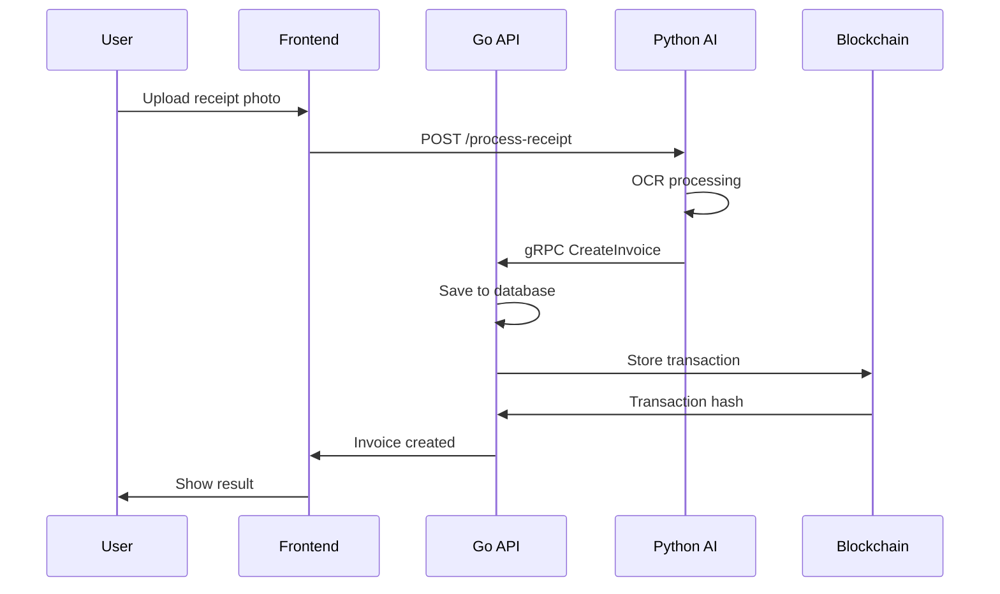
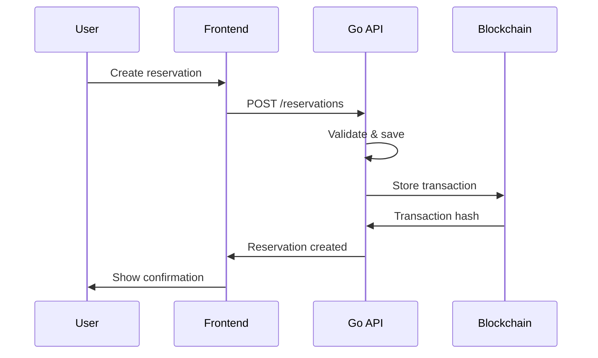

# 🏗️ ChainRice Ecosystem - Архітектура

## 📋 Огляд системи

ChainRice Ecosystem складається з двох основних додатків, які працюють на спільному блокчейні:

- **🍚 ChainRice** - Бухгалтерська система з AI розпізнаванням чеків
- **🐱 Meowtopia** - Адміністративна система для кафе з котами

## 🏛️ Архітектурна діаграма

```
┌─────────────────────────────────────────────────────────────────┐
│                    ChainRice Ecosystem                          │
├─────────────────────────────────────────────────────────────────┤
│                                                                 │
│  ┌─────────────────┐    ┌─────────────────┐                    │
│  │   ChainRice     │    │   Meowtopia     │                    │
│  │   Frontend      │    │   Frontend      │                    │
│  │   (Port 5173)   │    │   (Port 5174)   │                    │
│  └─────────────────┘    └─────────────────┘                    │
│           │                       │                            │
│           ▼                       ▼                            │
│  ┌─────────────────┐    ┌─────────────────┐                    │
│  │   ChainRice     │    │   Meowtopia     │                    │
│  │   Go API        │    │   Go API        │                    │
│  │   (Port 8004)   │    │   (Port 8006)   │                    │
│  └─────────────────┘    └─────────────────┘                    │
│           │                       │                            │
│           ▼                       ▼                            │
│  ┌─────────────────┐    ┌─────────────────┐                    │
│  │   Python AI     │    │   Shared        │                    │
│  │   Service       │    │   Blockchain    │                    │
│  │   (Port 8005)   │    │   (Port 1317)   │                    │
│  └─────────────────┘    └─────────────────┘                    │
│                                                                 │
└─────────────────────────────────────────────────────────────────┘
```

## 🔧 Компоненти системи

### 1. Frontend (React + TypeScript)

#### ChainRice Frontend
```
src/
├── app.tsx                    # Головний компонент
├── layouts/                   # Макети
│   ├── MainLayout.tsx
│   └── navigation/
│       ├── Sidebar.tsx
│       └── TopBar.tsx
├── features/                  # Бізнес-логіка
│   ├── dashboard/
│   │   ├── pages/Dashboard.tsx
│   │   └── components/
│   └── invoices/
│       ├── pages/InvoiceManager.tsx
│       └── components/
├── services/                  # API клієнти
│   └── api/
├── types/                     # TypeScript типи
├── utils/                     # Утиліти
└── styles/                    # Стилі
```

#### Meowtopia Frontend
```
src/
├── app.tsx                    # Головний компонент
├── layouts/                   # Макети (спільні)
├── features/                  # Бізнес-логіка
│   ├── dashboard/            # Статистика кафе
│   ├── cats/                 # Управління котами
│   ├── menu/                 # Меню кафе
│   ├── reservations/         # Бронювання
│   └── orders/               # Замовлення
├── services/                  # API клієнти
├── types/                     # TypeScript типи
└── utils/                     # Утиліти
```

### 2. Backend (Go + gRPC)

#### ChainRice Go API
```
go/
├── cmd/accounting-api/        # Точка входу
├── internal/
│   ├── database/             # База даних
│   ├── services/             # Бізнес-логіка
│   │   ├── invoice_service.go
│   │   └── dashboard_service.go
│   └── handlers/             # HTTP/gRPC handlers
├── pkg/proto/                # Protobuf файли
└── go.mod                    # Залежності
```

#### Meowtopia Go API
```
go/
├── cmd/meowtopia-api/        # Точка входу
├── internal/
│   ├── database/             # База даних
│   ├── services/             # Бізнес-логіка
│   │   ├── cat_service.go
│   │   ├── menu_service.go
│   │   ├── reservation_service.go
│   │   └── order_service.go
│   └── handlers/             # HTTP/gRPC handlers
└── pkg/proto/                # Protobuf файли
```

### 3. AI Service (Python + FastAPI)

```
python/
├── main.py                   # Точка входу FastAPI
├── services/
│   ├── receipt_processor.py  # AI розпізнавання чеків
│   └── grpc_client.py       # gRPC клієнт
├── models/
│   └── invoice.py           # Pydantic моделі
└── requirements.txt         # Python залежності
```

### 4. Blockchain (Cosmos SDK)

```
go/
├── cmd/chainrice/           # Блокчейн нода
├── x/chainrice/            # Модуль блокчейну
│   ├── keeper/            # Бізнес-логіка
│   ├── types/             # Типи даних
│   └── module/            # Конфігурація модуля
├── chain-data/            # Дані блокчейну
└── proto/                 # Protobuf схеми
```

### 5. Protobuf Schema

```
proto/
├── shared/                 # Спільні схеми
│   └── common.proto
├── accounting/             # Бухгалтерські схеми
│   └── accounting.proto
├── meowtopia/             # Схеми кафе
│   └── cafe.proto
└── chainrice/             # Блокчейн схеми
    └── module/
```

## 🔄 Потоки даних

### 1. ChainRice Workflow



### 2. Meowtopia Workflow



## 🗄️ База даних

### ChainRice Database Schema

```sql
-- Invoices
CREATE TABLE invoices (
    id TEXT PRIMARY KEY,
    invoice_number TEXT UNIQUE NOT NULL,
    vendor_name TEXT NOT NULL,
    vendor_tax_id TEXT,
    vendor_address TEXT,
    date DATETIME NOT NULL,
    due_date DATETIME,
    total_amount REAL NOT NULL,
    tax_amount REAL NOT NULL,
    net_amount REAL NOT NULL,
    currency TEXT DEFAULT 'UAH',
    description TEXT,
    category TEXT,
    status TEXT DEFAULT 'pending',
    receipt_image_path TEXT,
    created_at DATETIME DEFAULT CURRENT_TIMESTAMP,
    updated_at DATETIME DEFAULT CURRENT_TIMESTAMP
);

-- Invoice Items
CREATE TABLE invoice_items (
    id TEXT PRIMARY KEY,
    invoice_id TEXT NOT NULL,
    name TEXT NOT NULL,
    description TEXT,
    quantity INTEGER NOT NULL,
    unit_price REAL NOT NULL,
    total_price REAL NOT NULL,
    tax_rate REAL DEFAULT 0.20,
    category TEXT,
    FOREIGN KEY (invoice_id) REFERENCES invoices (id) ON DELETE CASCADE
);
```

### Meowtopia Database Schema

```sql
-- Cats
CREATE TABLE cats (
    id TEXT PRIMARY KEY,
    name TEXT NOT NULL,
    age INTEGER,
    breed TEXT,
    color TEXT,
    gender TEXT,
    weight REAL,
    health_status TEXT,
    personality TEXT,
    description TEXT,
    image_urls TEXT, -- JSON array
    is_adoptable BOOLEAN DEFAULT TRUE,
    is_active BOOLEAN DEFAULT TRUE,
    arrival_date DATETIME,
    created_at DATETIME DEFAULT CURRENT_TIMESTAMP,
    updated_at DATETIME DEFAULT CURRENT_TIMESTAMP
);

-- Menu Items
CREATE TABLE menu_items (
    id TEXT PRIMARY KEY,
    name TEXT NOT NULL,
    description TEXT,
    price REAL NOT NULL,
    category TEXT,
    image_url TEXT,
    is_available BOOLEAN DEFAULT TRUE,
    allergens TEXT, -- JSON array
    preparation_time INTEGER,
    rating REAL DEFAULT 0,
    order_count INTEGER DEFAULT 0,
    created_at DATETIME DEFAULT CURRENT_TIMESTAMP,
    updated_at DATETIME DEFAULT CURRENT_TIMESTAMP
);

-- Reservations
CREATE TABLE reservations (
    id TEXT PRIMARY KEY,
    customer_name TEXT NOT NULL,
    customer_phone TEXT,
    customer_email TEXT,
    party_size INTEGER NOT NULL,
    reservation_date DATETIME NOT NULL,
    duration_minutes INTEGER DEFAULT 120,
    special_requests TEXT,
    status TEXT DEFAULT 'pending',
    table_number TEXT,
    total_cost REAL DEFAULT 0,
    created_at DATETIME DEFAULT CURRENT_TIMESTAMP,
    updated_at DATETIME DEFAULT CURRENT_TIMESTAMP
);
```

## 🔐 Безпека

### 1. API Security
- **CORS** налаштований для фронтенду
- **Rate limiting** для API endpoints
- **Input validation** через protobuf схеми
- **SQL injection** захист через prepared statements

### 2. Blockchain Security
- **Cosmos SDK** валідація транзакцій
- **Merkle trees** для цілісності даних
- **Consensus mechanism** для синхронізації
- **Private keys** зберігаються в keyring

### 3. Data Privacy
- **Локальне зберігання** чутливих даних
- **Шифрування** в транзиті (HTTPS/gRPC)
- **GDPR compliance** для персональних даних
- **Audit logs** для відстеження доступу

## 🚀 Deployment

### 1. Development
```bash
# Локальний запуск
make install
make start

# Або через Docker
make docker
```

### 2. Production
```bash
# Використання Docker Compose з production профілем
docker-compose --profile production up -d

# Або Kubernetes
kubectl apply -f k8s/
```

### 3. Monitoring
- **Health checks** для всіх сервісів
- **Prometheus metrics** для Go API
- **Log aggregation** через ELK stack
- **Error tracking** через Sentry

## 📊 Performance

### 1. Frontend
- **Code splitting** для швидкого завантаження
- **Lazy loading** компонентів
- **React Query** для кешування API
- **Tailwind CSS** для оптимізації стилів

### 2. Backend
- **gRPC** для швидкої комунікації
- **Connection pooling** для бази даних
- **Caching** через Redis
- **Async processing** для AI задач

### 3. Blockchain
- **Tendermint consensus** для швидкості
- **State pruning** для оптимізації
- **Parallel processing** транзакцій
- **Load balancing** для високого навантаження

## 🔧 Розробка

### 1. Code Standards
- **TypeScript** для фронтенду
- **Go** для бекенду з стандартним форматуванням
- **Python** з PEP 8 стилем
- **Protobuf** для API контрактів

### 2. Testing
- **Unit tests** для всіх компонентів
- **Integration tests** для API
- **E2E tests** для фронтенду
- **Blockchain tests** для smart contracts

### 3. CI/CD
- **GitHub Actions** для автоматизації
- **Automated testing** на кожен PR
- **Docker builds** для deployment
- **Security scanning** для залежностей

## 📈 Масштабування

### 1. Horizontal Scaling
- **Load balancers** для API серверів
- **Database sharding** для великих обсягів даних
- **CDN** для статичних ресурсів
- **Microservices** архітектура

### 2. Vertical Scaling
- **Resource monitoring** для оптимізації
- **Memory optimization** для Go сервісів
- **GPU acceleration** для AI задач
- **SSD storage** для швидкості

### 3. Geographic Distribution
- **Multi-region deployment**
- **Edge computing** для AI сервісів
- **Data replication** для надійності
- **Latency optimization** для UX

---

**ChainRice Ecosystem** - сучасне рішення для бухгалтерії та управління бізнесом з інтеграцією блокчейн технологій.
