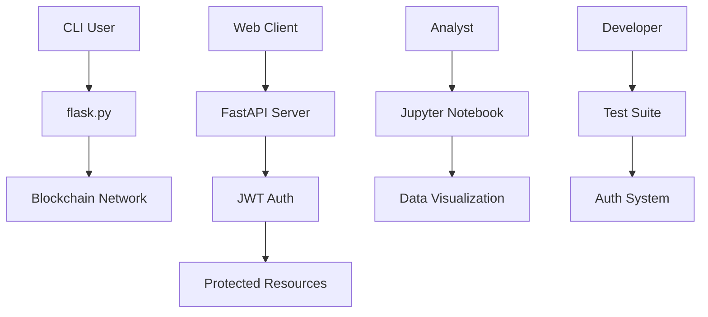

# 🏗️ Architektura Chain Rice Python SDK

## 📋 Przegląd Systemu

Chain Rice Python SDK to kompleksowe rozwiązanie do integracji z blockchainem, oferujące:
- **CLI Tools** - narzędzia wiersza poleceń do zarządzania blockchainem
- **REST API** - serwery Flask i FastAPI do komunikacji z siecią
- **Authentication** - system JWT z rolami użytkowników
- **Data Analysis** - notebooki Jupyter do analizy danych blockchain
- **Testing Suite** - kompletne testy jednostkowe i integracyjne

## 🗂️ Struktura Projektu

### 📁 Główne Moduły

```
python/
├── 🚀 fast_api.py          # FastAPI server (produkcyjny)
├── 🌶️ flask.py             # Flask server (development)
├── 🔐 jwt_auth.py          # System autoryzacji JWT
├── 📊 analysis.ipynb       # Analiza danych blockchain
├── 🧪 tests/               # Testy jednostkowe
├── 🔧 utils/               # Narzędzia pomocnicze
├── 🌐 api/                 # API endpoints
├── 🛡️ auth/                # Moduły autoryzacji
└── 🖥️ server/              # Serwery aplikacji
```

### 🔧 Komponenty Techniczne

#### **CLI Application** (`flask.py`)
- **Funkcja**: Interfejs wiersza poleceń do zarządzania blockchainem
- **Entry Point**: `hello` (zdefiniowany w `pyproject.toml`)
- **Użycie**: `hello <nazwa>` - wysyła powitanie do sieci blockchain

#### **FastAPI Server** (`fast_api.py`)
- **Funkcja**: Wysokowydajny serwer API dla produkcji
- **Port**: 8000
- **Endpoint**: `/hello?name=<nazwa>`
- **Features**: Automatyczna dokumentacja Swagger, async support

#### **Flask Server** (`flask.py`)
- **Funkcja**: Lekki serwer do developmentu i prototypowania
- **Port**: 5000 (domyślnie)
- **Endpoint**: `/hello?name=<nazwa>`
- **Features**: Hot reload, debug mode

#### **JWT Authentication** (`jwt_auth.py`)
- **Funkcja**: Kompletny system autoryzacji z rolami
- **Algorytm**: HS256
- **Role**: `admin`, `user`
- **Test Users**:
  - `admin@test.com` / `admin123` (rola: admin)
  - `user@test.com` / `user123` (rola: user)

#### **Data Analysis** (`analysis.ipynb`)
- **Funkcja**: Jupyter notebook do analizy danych blockchain
- **Biblioteki**: NumPy, Pandas, Matplotlib
- **Features**: Wizualizacja transakcji, analiza trendów

### 🧪 Testing Infrastructure

#### **Test Suite** (`tests/test_auth.py`)
- **Funkcja**: Kompletne testy systemu autoryzacji
- **Coverage**: Login, token verification, protected endpoints
- **Test Users**: Admin i user scenarios
- **API Testing**: HTTP requests do wszystkich endpointów

#### **Password Generator** (`utils/generate_passwords.py`)
- **Funkcja**: Generowanie hashów haseł dla testów
- **Algorithm**: bcrypt
- **Output**: Gotowe hashe do kopiowania do `jwt_auth.py`

## 🔄 Przepływ Danych



## 🚀 Deployment

### **Development**
```bash
# CLI
python flask.py

# FastAPI Server
python fast_api.py

# Flask Server  
python flask.py
```

### **Production**
```bash
# Docker
docker build -t chain-rice-python .
docker run -p 8000:8000 chain-rice-python

# Poetry
poetry install
poetry run hello <nazwa>
```

## 📈 Rozszerzanie Systemu

### **Dodawanie Nowych Modułów**
1. **API Endpoints**: Dodaj do `api/` directory
2. **Authentication**: Rozszerz `auth/` z nowymi rolami
3. **Utilities**: Dodaj narzędzia do `utils/`
4. **Tests**: Rozszerz `tests/` o nowe scenariusze

### **Konfiguracja**
- **Dependencies**: `pyproject.toml` (Poetry)
- **Environment**: `.env` file dla zmiennych
- **Docker**: `Dockerfile` dla konteneryzacji

### **Monitoring & Logging**
- **Structured Logging**: JSON logs dla produkcji
- **Metrics**: Prometheus endpoints
- **Health Checks**: `/health` endpoint

## 🔒 Bezpieczeństwo

- **JWT Tokens**: 30-minutowy czas życia
- **Password Hashing**: bcrypt z salt
- **Role-based Access**: Admin/User permissions
- **Environment Variables**: Secret keys w zmiennych środowiskowych
- **HTTPS**: Wymagane w produkcji

## 📊 Performance

- **FastAPI**: Async/await dla wysokiej wydajności
- **Connection Pooling**: Dla połączeń z blockchainem
- **Caching**: Redis dla często używanych danych
- **Rate Limiting**: Ochrona przed nadużyciami

---

*Ten system został zaprojektowany jako przykład real-world aplikacji blockchain, łączącej najlepsze praktyki Python development z nowoczesnymi wzorcami architektury.*
