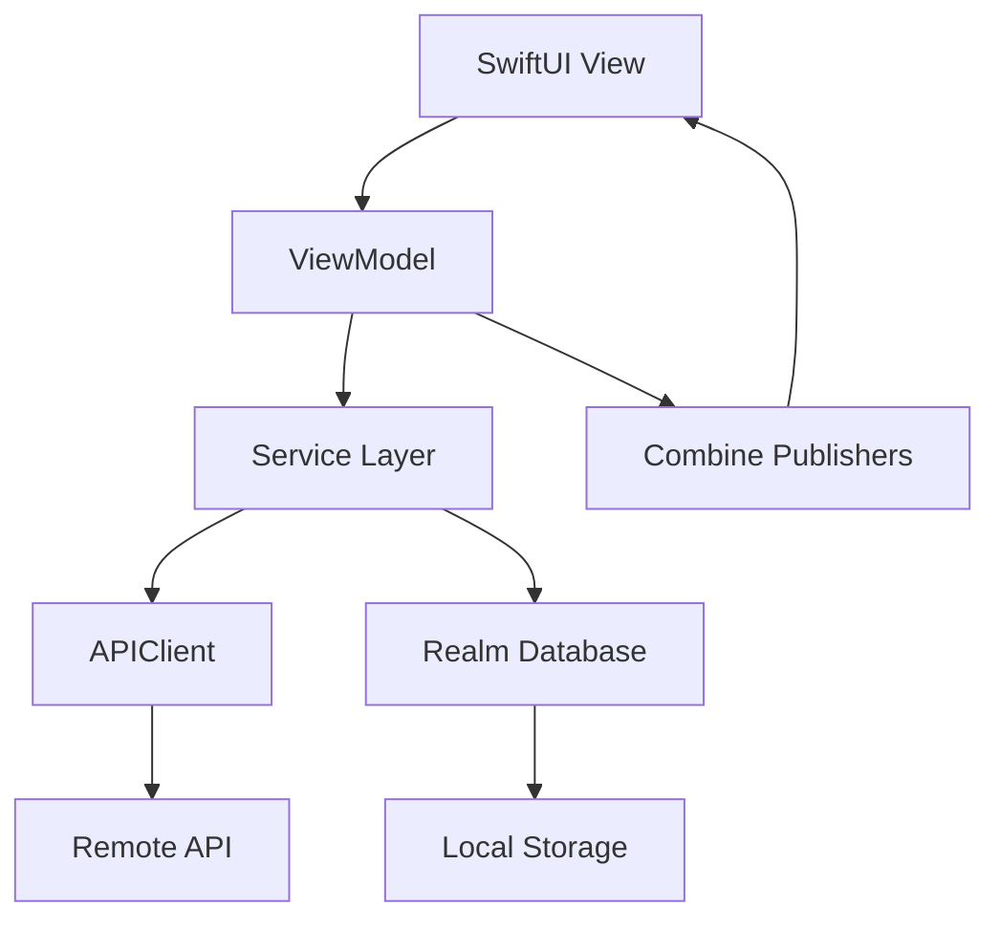

# Architektura TaskFlow Pro

## 🏗️ Przegląd Architektury

**TaskFlow Pro** wykorzystuje nowoczesną architekturę iOS opartą na wzorcu **MVVM (Model-View-ViewModel)** z dodatkowymi warstwami abstrakcji dla skalowalności i testowalności.

## 📁 Struktura Projektu

```
TaskFlowPro/
├── Sources/
│   ├── TaskFlowPro/              # Główna aplikacja
│   │   ├── TaskFlowProApp.swift  # Entry point aplikacji
│   │   ├── Views/                # Warstwa prezentacji
│   │   │   ├── DashboardView.swift
│   │   │   ├── TaskListView.swift
│   │   │   ├── ProjectListView.swift
│   │   │   ├── AnalyticsView.swift
│   │   │   ├── ProfileView.swift
│   │   │   ├── AuthenticationView.swift
│   │   │   ├── CreateTaskView.swift
│   │   │   ├── CreateProjectView.swift
│   │   │   └── Components/        # Komponenty wielokrotnego użytku
│   │   └── main.swift            # Executable entry point
│   └── TaskFlowCore/             # Logika biznesowa
│       ├── Models/               # Modele danych
│       │   ├── User.swift
│       │   ├── Project.swift
│       │   └── Task.swift
│       ├── Services/             # Serwisy biznesowe
│       │   ├── TaskService.swift
│       │   └── ProjectService.swift
│       ├── ViewModels/           # ViewModels MVVM
│       │   ├── DashboardViewModel.swift
│       │   └── TaskListViewModel.swift
│       └── Network/              # Warstwa sieciowa
│           └── APIClient.swift
└── Tests/
    └── TaskFlowProTests/         # Testy jednostkowe
```

## 🎯 Wzorce Projektowe

### MVVM (Model-View-ViewModel)
- **Model**: Modele danych (`User`, `Project`, `Task`)
- **View**: Widoki SwiftUI (`DashboardView`, `TaskListView`)
- **ViewModel**: Logika prezentacji (`DashboardViewModel`, `TaskListViewModel`)

### Repository Pattern
- Abstrakcja dostępu do danych
- Łączenie lokalnych i zdalnych źródeł danych
- Testowalność i modularność

### Service Layer
- Enkapsulacja logiki biznesowej
- Dependency Injection
- Async/await dla operacji sieciowych

## 🔄 Przepływ Danych



## 📱 Warstwy Aplikacji

### 1. Presentation Layer (SwiftUI)
- **Responsibility**: Interfejs użytkownika
- **Technologies**: SwiftUI, Combine
- **Patterns**: Declarative UI, State Management

### 2. Business Logic Layer (ViewModels)
- **Responsibility**: Logika prezentacji, stan aplikacji
- **Technologies**: Combine, @Published properties
- **Patterns**: MVVM, Reactive Programming

### 3. Service Layer
- **Responsibility**: Logika biznesowa, koordynacja danych
- **Technologies**: Combine, async/await
- **Patterns**: Repository, Service Locator

### 4. Data Layer
- **Responsibility**: Dostęp do danych, cache, synchronizacja
- **Technologies**: Realm, Alamofire, Core Data
- **Patterns**: Repository, Data Source

### 5. Network Layer
- **Responsibility**: Komunikacja z API
- **Technologies**: Alamofire, URLSession
- **Patterns**: Client-Server, RESTful API

## 🗄️ Zarządzanie Danymi

### Realm Database
```swift
// Konfiguracja Realm
let config = Realm.Configuration(
    schemaVersion: 1,
    migrationBlock: { migration, oldSchemaVersion in
        // Handle migrations
    }
)
```

### Offline-First Architecture
- Lokalne przechowywanie danych
- Synchronizacja w tle
- Graceful degradation przy braku połączenia

### Data Synchronization
- Real-time updates
- Conflict resolution
- Optimistic updates

## 🌐 Networking Architecture

### APIClient
```swift
class APIClient {
    func request<T: Codable>(
        endpoint: String,
        method: HTTPMethod,
        parameters: Parameters?,
        responseType: T.Type
    ) async throws -> T
}
```

### Error Handling
- Typed errors (`APIError`)
- Retry mechanisms
- Offline fallbacks

## 🧪 Testowanie

### Unit Tests
- ViewModels
- Services
- Models
- Utilities

### Integration Tests
- API integration
- Database operations
- End-to-end workflows

### UI Tests
- SwiftUI previews
- User interactions
- Accessibility testing

## 🔧 Dependency Management

### Swift Package Manager
```swift
dependencies: [
    .package(url: "https://github.com/Alamofire/Alamofire.git", from: "5.8.0"),
    .package(url: "https://github.com/realm/realm-swift.git", from: "10.45.0"),
    // ...
]
```

### Dependency Injection
- Protocol-based dependencies
- Mock objects for testing
- Service locator pattern

## 📊 Performance Considerations

### Memory Management
- Weak references w closures
- Proper cleanup w ViewModels
- Image caching z Kingfisher

### Network Optimization
- Request caching
- Image lazy loading
- Background sync

### UI Performance
- LazyVStack/LazyHStack
- View recycling
- Efficient state updates

## 🔒 Security Architecture

### Data Protection
- HTTPS only
- Token-based authentication
- Local data encryption

### Input Validation
- Client-side validation
- Server-side validation
- Sanitization

## 🚀 Rozszerzenia i Skalowanie

### Modular Architecture
- Feature-based modules
- Shared components
- Plugin architecture

### Future Enhancements
- Real-time collaboration
- Advanced analytics
- AI-powered insights
- Cross-platform support

## 📚 Dokumentacja Kodu

### Code Documentation
- Swift DocC comments
- Architecture decision records
- API documentation

### Best Practices
- SOLID principles
- Clean Code
- Design Patterns
- Performance guidelines

---

**Ta architektura zapewnia skalowalność, testowalność i łatwość utrzymania kodu, tworząc solidną podstawę dla profesjonalnej aplikacji iOS.**


