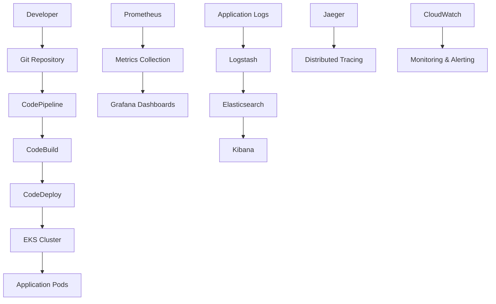

# 🏗️ Architektura Zaawansowanej Infrastruktury Terraform

## 📋 Przegląd Architektury

**Advanced Infrastructure as Code** wykorzystuje nowoczesną architekturę Terraform z modularnym podejściem, multi-cloud support i kompleksowym stosem monitoringu i bezpieczeństwa.

## 🎯 Wzorce Projektowe

### Modular Architecture
- **Separation of Concerns** - każdy moduł ma określoną odpowiedzialność
- **Reusability** - moduły mogą być używane w różnych środowiskach
- **Maintainability** - łatwość utrzymania i aktualizacji
- **Testability** - możliwość testowania poszczególnych modułów

### Environment Separation
- **Dev Environment** - optymalizacja kosztów, szybkie iteracje
- **Staging Environment** - testowanie przed produkcją
- **Production Environment** - wysoka dostępność, bezpieczeństwo

### Infrastructure as Code Principles
- **Idempotency** - wielokrotne uruchomienie daje ten sam rezultat
- **Declarative** - opisujemy stan docelowy, nie kroki
- **Version Control** - wszystkie zmiany w Git
- **Automation** - pełna automatyzacja procesów

## 📁 Struktura Modułów

### 1. Networking Module (`modules/networking/`)
**Odpowiedzialność**: Zarządzanie siecią VPC i komponentami sieciowymi

```hcl
# Komponenty:
- VPC z custom CIDR
- Public/Private/Database subnets
- Internet Gateway i NAT Gateways
- Route tables i associations
- VPC endpoints dla AWS services
- Security groups dla VPC endpoints
```

**Funkcje**:
- Multi-AZ deployment
- Public/private subnet separation
- Database subnet group
- VPC endpoints dla cost optimization
- Custom DNS resolution

### 2. Security Module (`modules/security/`)
**Odpowiedzialność**: Bezpieczeństwo i compliance

```hcl
# Komponenty:
- Security groups
- Network ACLs
- WAF rules
- Shield protection
- GuardDuty configuration
- Config rules
- KMS encryption
```

**Funkcje**:
- Defense in depth
- Network segmentation
- Threat detection
- Compliance monitoring
- Encryption management

### 3. Compute Module (`modules/compute/`)
**Odpowiedzialność**: Zasoby obliczeniowe

```hcl
# Komponenty:
- Auto Scaling Groups
- Launch Templates
- EC2 instances
- Load Balancers
- Target Groups
```

**Funkcje**:
- Auto-scaling capabilities
- Spot instance support
- Load balancing
- Health checks
- Cost optimization

### 4. Database Module (`modules/database/`)
**Odpowiedzialność**: Zarządzanie bazami danych

```hcl
# Komponenty:
- RDS instances
- Read replicas
- Parameter groups
- Subnet groups
- Security groups
```

**Funkcje**:
- Multi-AZ deployment
- Automated backups
- Read replicas
- Performance optimization
- High availability

### 5. Kubernetes Module (`modules/kubernetes/`)
**Odpowiedzialność**: Orchestracja kontenerów

```hcl
# Komponenty:
- EKS cluster
- Node groups
- Add-ons (CoreDNS, kube-proxy, VPC CNI)
- IRSA (IAM Roles for Service Accounts)
- OIDC provider
```

**Funkcje**:
- Managed Kubernetes
- Auto-scaling nodes
- Load balancer controller
- Pod security standards
- Network policies

### 6. Monitoring Module (`modules/monitoring/`)
**Odpowiedzialność**: Monitoring i observability

```hcl
# Komponenty:
- Prometheus server
- Grafana dashboards
- ELK stack
- Jaeger tracing
- CloudWatch integration
```

**Funkcje**:
- Metrics collection
- Log aggregation
- Distributed tracing
- Alerting
- Visualization

### 7. CI/CD Module (`modules/cicd/`)
**Odpowiedzialność**: Automatyzacja procesów

```hcl
# Komponenty:
- CodePipeline
- CodeBuild projects
- CodeDeploy applications
- GitHub integration
- Automated testing
```

**Funkcje**:
- Continuous integration
- Automated deployment
- Testing automation
- GitOps workflows
- Rollback capabilities

## 🔄 Przepływ Danych



## 📱 Warstwy Aplikacji

### 1. Presentation Layer
- **Load Balancers** - Application Load Balancer
- **CDN** - CloudFront
- **WAF** - Web Application Firewall

### 2. Application Layer
- **EKS Cluster** - Kubernetes orchestration
- **Auto Scaling** - Horizontal Pod Autoscaler
- **Service Mesh** - Istio (optional)

### 3. Data Layer
- **RDS** - Managed database
- **ElastiCache** - Redis/Memcached
- **S3** - Object storage

### 4. Monitoring Layer
- **Prometheus** - Metrics collection
- **Grafana** - Visualization
- **ELK Stack** - Log management
- **Jaeger** - Distributed tracing

## 🗄️ Zarządzanie Stanem

### Remote State Configuration
```hcl
terraform {
  backend "s3" {
    bucket         = "terraform-state-bucket"
    key            = "infrastructure/terraform.tfstate"
    region         = "us-west-2"
    encrypt        = true
    dynamodb_table = "terraform-state-lock"
  }
}
```

### State Management Best Practices
- **Remote State** - S3 backend z DynamoDB locking
- **State Separation** - osobny stan dla każdego środowiska
- **State Encryption** - szyfrowanie stanu
- **State Backup** - automatyczne kopie zapasowe
- **State Versioning** - wersjonowanie stanu

## 🌐 Networking Architecture

### VPC Design
```
VPC (10.0.0.0/16)
├── Public Subnets (10.0.1.0/24, 10.0.2.0/24, 10.0.3.0/24)
│   ├── Internet Gateway
│   ├── NAT Gateways
│   └── Load Balancers
├── Private Subnets (10.0.11.0/24, 10.0.12.0/24, 10.0.13.0/24)
│   ├── EKS Nodes
│   ├── Application Servers
│   └── Monitoring Servers
└── Database Subnets (10.0.21.0/24, 10.0.22.0/24, 10.0.23.0/24)
    ├── RDS Instances
    ├── ElastiCache
    └── Database Servers
```

### Security Groups
- **Web Tier** - HTTP/HTTPS traffic
- **Application Tier** - Internal communication
- **Database Tier** - Database access only
- **Monitoring Tier** - Monitoring services

## ☸️ Kubernetes Architecture

### Cluster Design
```
EKS Cluster
├── Control Plane (Managed)
│   ├── API Server
│   ├── etcd
│   ├── Scheduler
│   └── Controller Manager
├── Node Groups
│   ├── System Nodes (t3.medium)
│   ├── Application Nodes (t3.large)
│   └── Database Nodes (t3.xlarge)
└── Add-ons
    ├── CoreDNS
    ├── kube-proxy
    ├── VPC CNI
    └── EBS CSI Driver
```

### Pod Security Standards
- **Restricted** - najwyższy poziom bezpieczeństwa
- **Baseline** - podstawowy poziom bezpieczeństwa
- **Privileged** - dla systemowych podów

## 📊 Monitoring Architecture

### Metrics Flow
```
Applications → Prometheus → Grafana
     ↓
CloudWatch → Alerts → SNS → Email/Slack
```

### Log Flow
```
Applications → Logstash → Elasticsearch → Kibana
     ↓
CloudWatch Logs → Log Insights
```

### Tracing Flow
```
Applications → Jaeger Agent → Jaeger Collector → Jaeger Storage
```

## 🔒 Security Architecture

### Defense in Depth
1. **Network Level** - VPC, Security Groups, NACLs
2. **Application Level** - WAF, Shield
3. **Data Level** - KMS encryption
4. **Identity Level** - IAM, RBAC
5. **Monitoring Level** - GuardDuty, Config

### Compliance Framework
- **SOC 2** - Security, availability, confidentiality
- **PCI DSS** - Payment card industry standards
- **GDPR** - General data protection regulation
- **HIPAA** - Healthcare information privacy

## 🚀 CI/CD Architecture

### Pipeline Flow
```
Code Commit → Build → Test → Security Scan → Deploy → Monitor
```

### Deployment Strategies
- **Blue-Green** - zero-downtime deployment
- **Canary** - gradual rollout
- **Rolling** - rolling updates
- **Recreate** - complete replacement

## 📈 Performance Considerations

### Auto Scaling
- **Horizontal Pod Autoscaler** - pod scaling
- **Cluster Autoscaler** - node scaling
- **Vertical Pod Autoscaler** - resource scaling

### Cost Optimization
- **Spot Instances** - cost-effective compute
- **Reserved Instances** - long-term savings
- **Right Sizing** - optimal resource allocation
- **Scheduled Scaling** - time-based scaling

## 🔧 Operational Excellence

### Monitoring and Alerting
- **SLI/SLO/SLA** - service level objectives
- **Error Budgets** - reliability targets
- **Incident Response** - automated workflows
- **Post-Mortems** - learning from failures

### Disaster Recovery
- **Backup Strategy** - automated backups
- **Cross-Region Replication** - geographic redundancy
- **RTO/RPO** - recovery time/point objectives
- **Testing** - regular DR drills

## 📚 Documentation Standards

### Code Documentation
- **README files** - module descriptions
- **Variable descriptions** - input parameters
- **Output descriptions** - return values
- **Examples** - usage examples

### Architecture Documentation
- **Architecture Decision Records** - ADRs
- **Runbooks** - operational procedures
- **Troubleshooting Guides** - problem resolution
- **Best Practices** - recommended approaches

---

**Ta architektura zapewnia skalowalność, bezpieczeństwo i łatwość utrzymania, tworząc solidną podstawę dla profesjonalnej infrastruktury chmurowej.**
